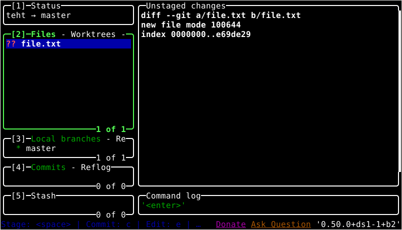
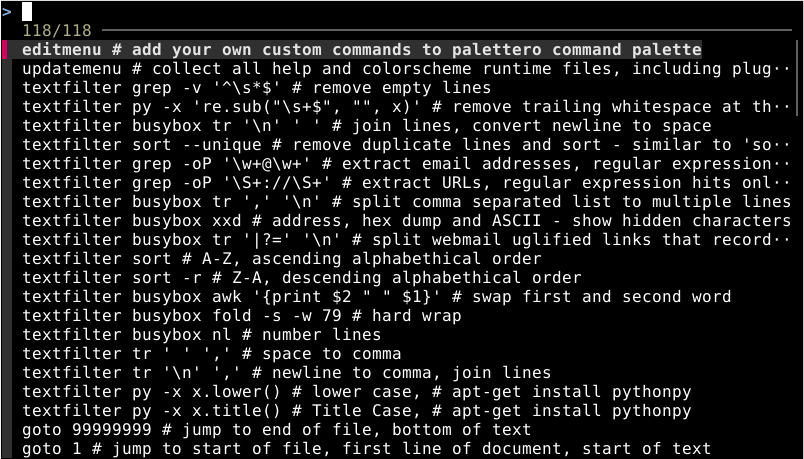

## Artikkelin tiivistys[^1]
| Komento | Selitys |
|:---------|:---------|
| `pwd` | tulostaa nykyisen työhakemiston polun |
| `ls` | listaa tiedostot ja kansiot nykyisessä hakemistossa |
| `cd` | vaihtaa nykyisen työhakemiston |
| `mkdir` | luo uuden kansion |
| `mv` | siirtää tai uudelleennimeää tiedoston tai kansion |
| `cp` | kopioi tiedoston tai kansion |
| `rmdir` | poistaa **tyhjän** kansion |
| `rm` | poistaa tiedston tai kansion (`-r` rekursiivisesti) |
| `ssh` | turvallinen etäyhteys toiseen koneeseen |
| `scp` | turvallinen tiedostonsiirto koneiden välillä |
| `man` | näyttää komennon käyttöohjeen |

- Tabilla voi täydentää komentoja sekä tiedosto tai kansiopolkuja.
- Ctrl-r voidaan hakea aiemmin suoritettuja komentoja historiasta.

Tärkeitä polkuja:
| Polku | Selitys |
|:---------|:---------|
| `/` | juurihakemisto |
| `/home` | käyttäjien kotihakemistot |
| `/etc` | järjestelmän kattavat asetukset |
| `/media` | ulkoiset tallennusvälineet |
| `/var/log` | järjestelmän lokitiedostot |

Sovellusten hallinta:
```bash
# asennus
sudo apt-get install <sovellus1> <sovellus2> #...
# poisto (säilyttää asetustiedostot)
sudo apt-get remove <sovellus1> <sovellus2> #...
# poisto (poistaa myös asetustiedostot)
sudo apt-get purge <sovellus1> <sovellus2> #...

# komentoihin voidaan myös lisätä -y joka valitsee oletusarvon kysyttäessä
```

## Tehtävät

### a) Micro
```bash
sudo apt install micro -y
```

### b) Apt
```bash
sudo apt install cowsay git lazygit lshw # tehdään lshw asennus myös tässä f) tehtävää varten
```

cowsay
```bash
$ cowsay hello
 _______
< hello >
 -------
        \   ^__^
         \  (oo)\_______
            (__)\       )\/\
                ||----w |
                ||     ||
```

git & lazygit
```bash
git init teht; cd teht
touch file.txt

# TUI:n avulla
lazygit

# tai perinteisesti
git add file.txt
git commit -m "add file.txt"
```

lazygitissä voidaan tehdä kaikki gitin perustoiminnot (commit, push, pull, branch, merge) TUI:n avulla.




### c) FHS

```bash
$ ls /
bin   etc         initrd.img.old  lost+found  opt   run   sys  var
boot  home        lib             media       proc  sbin  tmp  vmlinuz
dev   initrd.img  lib64           mnt         root  srv   usr  vmlinuz.old
```

```bash
$ ls /home/
user
```


```bash
$ ls /home/user
Desktop  Documents  Downloads  Music  Pictures  Public  Templates  Videos
```

```bash
$ ls /etc/
adduser.conf            fuse.conf        mailcap.order    rpc
adjtime                 gai.conf         manpath.config   sane.d
alsa                    geoclue          mdadm            security
alternatives            ghostscript      mime.types       selinux
# ...
```

```bash
$ ls /media/
user
```

```bash
$ ls /var/log
alternatives.log  bootstrap.log  dpkg.log        lastlog  README               wtmp            Xorg.1.log
apt               btmp           fontconfig.log  lightdm  speech-dispatcher    Xorg.0.log      Xorg.1.log.old
boot.log          cups           journal         private  vboxadd-install.log  Xorg.0.log.old
```

### d) The Friendly M. & e) Pipe
Nämä tulikin jo aiemassa tehtävässä h1 esiteltyä joten käytän samoja esimerkkejä tässä.

```bash
# etsitään tiedostosta rivejä jotka sisältävät tekstin "error"
cat log.txt | grep "error"

# etsitään tiedostosta rivejä jotka sisältävät tekstin "error" tai "warn" käyttämällä regexiä
cat log.txt | grep -E "error|warn"
```

Näitä voidaan tietenkin yhdistellä:
```bash
# etsitään tiedostosta rivejä jotka sisältävät tekstin "error" ja näytetään vain viimeiset 5 riviä
cat log.txt | grep "error" | tail -n 5

# etsitään tiedoston viimeisistä 5 rivistä rivejä jotka sisältävät tekstin "error"
cat log.txt | tail -n 5 | grep "error"

# yms..
```

### f) Rauta
Listauksesta näkyy järjestelmän laitteisto, mm. prosessori, muisti, verkkokortti, kovalevy jne. 

Tietenkin kyseessä on virtuaalikone joten laitteisto on kokonaan tai lähes kokonaan virtualisoitu. (passthrough myös mahdollinen, mutta en ole perehtynyt käyttääkö tai miltä osin VirtualBox sitä käyttää)

```bash
$ sudo lshw -short -sanitize
H/W path          Device      Class       Description
=====================================================
                              system      VirtualBox
/0                            bus         VirtualBox
/0/0                          memory      128KiB BIOS
/0/1                          memory      3200MiB System memory
/0/2                          processor   Intel(R) Core(TM) i5-10600K CPU @ 4.10GHz
/0/100                        bridge      440FX - 82441FX PMC [Natoma]
/0/100/1                      bridge      82371SB PIIX3 ISA [Natoma/Triton II]
/0/100/1/0                    input       PnP device PNP0303
/0/100/1/1                    input       PnP device PNP0f03
/0/100/1.1        scsi2       storage     82371AB/EB/MB PIIX4 IDE
/0/100/1.1/0.0.0  /dev/cdrom  disk        CD-ROM
/0/100/2          /dev/fb0    display     SVGA II Adapter
/0/100/3          enp0s3      network     82540EM Gigabit Ethernet Controller
/0/100/4          input9      input       VirtualBox mouse integration
/0/100/5          card0       multimedia  82801AA AC'97 Audio Controller
/0/100/6                      bus         KeyLargo/Intrepid USB
/0/100/6/1        usb2        bus         OHCI PCI host controller
/0/100/6/1/1      input6      input       VirtualBox USB Tablet
/0/100/7                      bridge      82371AB/EB/MB PIIX4 ACPI
/0/100/b                      bus         82801FB/FBM/FR/FW/FRW (ICH6 Family) USB2 EHCI Controller
/0/100/b/1        usb1        bus         EHCI Host Controller
/0/100/d          scsi1       storage     82801HM/HEM (ICH8M/ICH8M-E) SATA Controller [AHCI mode]
/0/100/d/0.0.0    /dev/sda    disk        42GB VBOX HARDDISK
/0/100/d/0.0.0/1  /dev/sda1   volume      33GiB EXT4 volume
/0/100/d/0.0.0/2  /dev/sda2   volume      6561MiB Linux swap volume
/1                input0      input       AT Translated Set 2 keyboard
/2                input2      input       Power Button
/3                input3      input       Sleep Button
/4                input4      input       Video Bus
/5                input5      input       ImExPS/2 Generic Explorer Mouse
/6                input7      input       PC Speaker
```

### h) Micro plugin asennus[^2]
```bash
sudo apt install fzf
mkdir -p $HOME/.config/micro/plug/
cd $HOME/.config/micro/plug/
git clone https://github.com/terokarvinen/palettero
```

testataan:

```bash
micro # painetaan ctrl+space
```



## Lähteet:
- Tehtävänanto: https://terokarvinen.com/linux-palvelimet/#h2-komentaja-pingviini
[^1]: Karvinen, T. 2020, Command Line Basics Revisited. Luettavissa: https://terokarvinen.com/2020/command-line-basics-revisited/. Luettu: 31.08.2025.
[^2]: Karvinen, T. 2022, GitHub - terokarvinen/palettero: Command palette - Ctrl-P to fuzzy search & run commands, textfilters and descriptions - Micro editor plugin. Luettavissa: https://github.com/terokarvinen/palettero. Luettu: 31.08.2025.