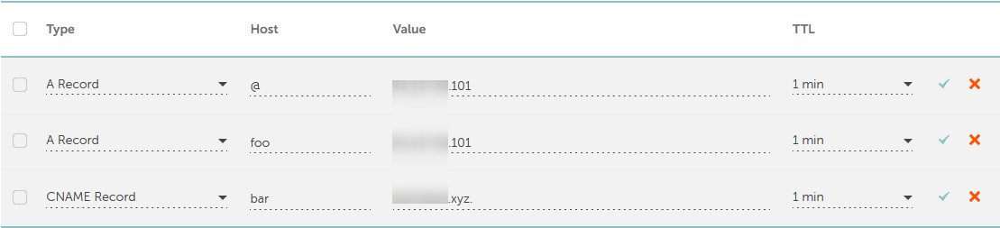
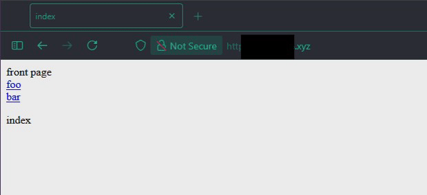

## Tehtävät

### a) & b kohdan bonus, nimi ja alidomainit
Päädyin varamaan itselleni domainin NameCheapin kautta, sillä minulla on jo siellä tili aikaisemman domain varauksen takia. Tehtävää varten päädyin varaamaan 1.111B luokan .xyz domainin joilla on kiinteä hinta $0.99 vuodessa (varaus sekä uusiminen). Kirjoitushetkellä domainin hinnaksi tuli yhteensä 0.84€.

1.111B luokan domainit koostuvat 6-9 merkistä, mutta vain numerot ovat sallittuja, joten tälläinen domaini ei ole kovin hyvä jos kyseessä on oikea yritys. Lisää 1.111B luokasta voi lukea [täältä.](https://aydacfu.xyz/)[^1]

Alla kuva domainin DNS asetuksista.


### b) Kotisivu
Tässä osiossa etäpalvelimen IP-osoite on korvattu ```<palvelimen-ip>``` tekstillä ja domain on korvattu ```<oma-domain>``` tekstillä.

```bash
# omalla koneella
mkdir -p $HOME/public_sites/h5
cd $HOME/public_sites/h5

# luon tässä vaiheessa sivut index.html, foo.html ja bar.html ...

$ ls
bar.html  foo.html  index.html
```

Kopioidaan sivut palvelimelle:
```bash
# omalla koneella

# varmistetaan että public_sites hakemisto on olemassa palvelimella
ssh user@<palvelimen-ip> "mkdir -p ~/public_sites/"

# kopioidaan sivut palvelimelle
$ scp -r $HOME/public_sites/h5 user@<palvelimen-ip>:~/public_sites/
foo.html                                      100%  303    10.9KB/s   00:00    
bar.html                                      100%  304    11.1KB/s   00:00    
index.html                                    100%  305    11.2KB/s   00:00
```

Tästä eteenpäin kaikki komennot suoritetaan etäpalvelimella ellei toisin mainita.

Tarkistetaan tiedostojen oikeudet:
```bash
$ ls -la $HOME/public_sites/h5
total 20
drwxrwxr-x 2 user user 4096 Sep 21 03:43 .
drwxrwxr-x 4 user user 4096 Sep 21 03:43 ..
-rw-rw-r-- 1 user user  304 Sep 21 03:43 bar.html
-rw-rw-r-- 1 user user  303 Sep 21 03:43 foo.html
-rw-rw-r-- 1 user user  305 Sep 21 03:43 index.html

# näyttäisi olevan ok
```

```bash
# luodaan uusi conf tiedosto
sudoedit /etc/apache2/sites-available/h5.conf

$ cat /etc/apache2/sites-available/h5.conf
<VirtualHost *:80>
 ServerName <oma-domain>
 ServerAlias foo.<oma-domain> bar.<oma-domain>
 DocumentRoot /home/user/public_sites/h5
 <Directory /home/user/public_sites/h5>
   Require all granted
 </Directory>
</VirtualHost>
```

Laitetaan uusi sivusto käyttöön
```bash
sudo a2ensite h5.conf
perl: warning: Setting locale failed.
perl: warning: Please check that your locale settings:
	LANGUAGE = (unset),
	LC_ALL = (unset),
	LC_CTYPE = (unset),
	LC_NUMERIC = "fi_FI.UTF-8",
	LC_COLLATE = (unset),
	LC_TIME = "fi_FI.UTF-8",
	LC_MESSAGES = (unset),
	LC_MONETARY = "fi_FI.UTF-8",
	LC_ADDRESS = "fi_FI.UTF-8",
	LC_IDENTIFICATION = "fi_FI.UTF-8",
	LC_MEASUREMENT = "fi_FI.UTF-8",
	LC_PAPER = "fi_FI.UTF-8",
	LC_TELEPHONE = "fi_FI.UTF-8",
	LC_NAME = "fi_FI.UTF-8",
	LANG = "en_US.UTF-8"
    are supported and installed on your system.
perl: warning: Falling back to a fallback locale ("en_US.UTF-8").
Enabling site h5.
To activate the new configuration, you need to run:
  systemctl reload apache2
```

Jotain varoituksia tulee kielistä, kokeillaan silti toimiiko
```bash
sudo systemctl reload apache2
```

Testataan:
```bash
$ curl -s <oma-domain>
<!DOCTYPE html>
<html lang="en">
<title>index</title>
<div>
    <div>
        <a>front page</a>
    </div>
    <div>
        <a href="foo.html">foo</a>
    </div>
    <div>
        <a href="bar.html">bar</a>
    </div>

    <div>
        <p>
            index
        </p>
    </div>
</div>

```

curl toimii, kokeillaan vielä selaimella:



näyttäisi toimivan.

Testataan vielä, että asettamamme alidomainit toimivat:
```bash
$ curl -I foo.<oma-domain>
HTTP/1.1 200 OK
Date: Sun, 21 Sep 2025 04:16:18 GMT
Server: Apache/2.4.65 (Debian)
Last-Modified: Sun, 21 Sep 2025 04:11:21 GMT
ETag: "123-63f47e53f1340"
Accept-Ranges: bytes
Content-Length: 291
Vary: Accept-Encoding
Content-Type: text/html

$ curl -I bar.<oma-domain>
HTTP/1.1 200 OK
Date: Sun, 21 Sep 2025 04:16:26 GMT
Server: Apache/2.4.65 (Debian)
Last-Modified: Sun, 21 Sep 2025 04:11:21 GMT
ETag: "123-63f47e53f1340"
Accept-Ranges: bytes
Content-Length: 291
Vary: Accept-Encoding
Content-Type: text/html

# kokeillaan alidomainia joka ei ole määritetty
$ curl -I baz.<oma-domain>
curl: (6) Could not resolve host: baz.<oma-domain>
```

### c) DNS-tietoja
Alla olevissa komennoissa oma domain, sekä oman palvelimen IP on korvattu tähdillä ```********.xyz``` ja ```***.***.***.101```

```bash
$ host
bash: host: command not found
$ dig
bash: dig: command not found
```

Näitä ohjelmia ei ole selvästi asennettu, ioflood[^2] sivuston mukaan host löytyy dnsutils paketista
```bash
sudo apt install dnsutils -y
```

```bash
$ host
Usage: host [-aCdilrTvVw] [-c class] [-N ndots] [-t type] [-W time]
            [-R number] [-m flag] [-p port] hostname [server]
# ...
```
Ja dig näyttäisi myös asentuvan samalla.
```bash
$ dig

; <<>> DiG 9.20.11-4-Debian <<>>
# ...
```

#### Oman domainin DNS tiedot

```
$ host ********.xyz
********.xyz has address ***.***.***.101

$ dig ********.xyz

; <<>> DiG 9.20.11-4-Debian <<>> ********.xyz
;; global options: +cmd
;; Got answer:
;; ->>HEADER<<- opcode: QUERY, status: NOERROR, id: 56383
;; flags: qr rd ra; QUERY: 1, ANSWER: 1, AUTHORITY: 0, ADDITIONAL: 1

;; OPT PSEUDOSECTION:
; EDNS: version: 0, flags:; udp: 1232
;; QUESTION SECTION:
;********.xyz.			IN	A

;; ANSWER SECTION:
********.xyz.		0	IN	A	***.***.***.101

;; Query time: 31 msec
;; SERVER: 10.0.2.3#53(10.0.2.3) (UDP)
;; WHEN: Sun Sep 21 05:00:05 EEST 2025
;; MSG SIZE  rcvd: 57
```

#### Pienen yrityksen DNS tiedot

Tehtävässä piti myös tarkistaa jonkun pienyrityksen DNS tiedot, joten otin Google Mapsista satunnaisesti jonkin oletettavasti pienen yrityksen "Ravintola Pyysaari" jonka nettisivuiksi on ilmoitettu [Helsingin Työväen Pursiseura](https://htps.fi)

```
$ host htps.fi
htps.fi has address 46.30.213.80
htps.fi has IPv6 address 2a02:2350:5:10b:80:b88e:cc3d:b52b
htps.fi mail is handled by 10 mx3.pub.mailpod10-cph3.one.com.
htps.fi mail is handled by 10 mx4.pub.mailpod10-cph3.one.com.
htps.fi mail is handled by 10 mx1.pub.mailpod10-cph3.one.com.
htps.fi mail is handled by 10 mx2.pub.mailpod10-cph3.one.com.

$ dig htps.fi

; <<>> DiG 9.20.11-4-Debian <<>> htps.fi
;; global options: +cmd
;; Got answer:
;; ->>HEADER<<- opcode: QUERY, status: NOERROR, id: 30636
;; flags: qr rd ra ad; QUERY: 1, ANSWER: 1, AUTHORITY: 0, ADDITIONAL: 1

;; OPT PSEUDOSECTION:
; EDNS: version: 0, flags:; udp: 1232
;; QUESTION SECTION:
;htps.fi.			IN	A

;; ANSWER SECTION:
htps.fi.		3349	IN	A	46.30.213.80

;; Query time: 39 msec
;; SERVER: 10.0.2.3#53(10.0.2.3) (UDP)
;; WHEN: Sun Sep 21 05:10:34 EEST 2025
;; MSG SIZE  rcvd: 52
```

Dig komennossa näkyy vain yksi A recordi, mutta host komenossa näkyy myös IPv6 osoite ja neljä MX recordia. Tehtävässä oli myös pyydetty etsimään miten Dig komento palauttaisi kaikki kentät, tämä tapahtuisi tietääkseni ANY kyselyllä, ```dig htps.fi ANY``` mutta tämä tuottaa virheen ```status: SERVFAIL``` ja ```ANY``` kyselyt on ilmeisesti estetty vuodesta 2019 eteenpäin[^3][^4].

Voimme kuitenkin hakea erikseen eri recordeja, esimerkiksi MX recordit:
```
$ dig htps.fi MX

; <<>> DiG 9.20.11-4-Debian <<>> htps.fi MX
;; global options: +cmd
;; Got answer:
;; ->>HEADER<<- opcode: QUERY, status: NOERROR, id: 24644
;; flags: qr rd ra ad; QUERY: 1, ANSWER: 4, AUTHORITY: 0, ADDITIONAL: 1

;; OPT PSEUDOSECTION:
; EDNS: version: 0, flags:; udp: 1232
;; QUESTION SECTION:
;htps.fi.			IN	MX

;; ANSWER SECTION:
htps.fi.		10295	IN	MX	10 mx2.pub.mailpod10-cph3.one.com.
htps.fi.		10295	IN	MX	10 mx3.pub.mailpod10-cph3.one.com.
htps.fi.		10295	IN	MX	10 mx4.pub.mailpod10-cph3.one.com.
htps.fi.		10295	IN	MX	10 mx1.pub.mailpod10-cph3.one.com.

;; Query time: 27 msec
;; SERVER: 10.0.2.3#53(10.0.2.3) (UDP)
;; WHEN: Sun Sep 21 05:17:42 EEST 2025
;; MSG SIZE  rcvd: 142
```

#### Suuren yrityksen DNS tiedot
```
$ host google.com
google.com has address 216.58.207.206
google.com has IPv6 address 2a00:1450:400f:801::200e
google.com mail is handled by 10 smtp.google.com.
google.com has HTTP service bindings 1 . alpn="h2,h3"

$ dig google.com

; <<>> DiG 9.20.11-4-Debian <<>> google.com
;; global options: +cmd
;; Got answer:
;; ->>HEADER<<- opcode: QUERY, status: NOERROR, id: 56285
;; flags: qr rd ra; QUERY: 1, ANSWER: 1, AUTHORITY: 0, ADDITIONAL: 1

;; OPT PSEUDOSECTION:
; EDNS: version: 0, flags:; udp: 1232
;; QUESTION SECTION:
;google.com.			IN	A

;; ANSWER SECTION:
google.com.		166	IN	A	216.58.207.206

;; Query time: 31 msec
;; SERVER: 10.0.2.3#53(10.0.2.3) (UDP)
;; WHEN: Sun Sep 21 05:21:04 EEST 2025
;; MSG SIZE  rcvd: 55
```


### d) SPF ja DMARC

Tiesin entuudestaan jo, että SPF tiedot löytyvät domainin TXT recordeista mutta uutena opin sen, että DMARC sen sijaan löytyy _dmarc alidomainista[^6].


```sh
# etsitään yle.fi domainin SPF ja DMARC tiedot
# SPF löytyy TXT recordeista
dig yle.fi TXT | grep spf
yle.fi.			14302	IN	TXT	"v=spf1 include:_spf.google.com include:sendgrid.net ip4:91.229.137.157 ip4:91.229.137.158 ~all"

# DMARC löytyy _dmarc alidomainista
$ dig _dmarc.yle.fi TXT | grep dmarc
; <<>> DiG 9.20.11-4-Debian <<>> _dmarc.yle.fi TXT
;_dmarc.yle.fi.			IN	TXT
_dmarc.yle.fi.		14314	IN	TXT	"v=DMARC1; p=quarantine; rua=mailto:dmarc-aggregate@yle.fi;"
```

Eli:

- SPF: ```v=spf1 include:_spf.google.com include:sendgrid.net ip4:91.229.137.157 ip4:91.229.137.158 ~all```
- DMARC: ```v=DMARC1; p=quarantine; rua=mailto:dmarc-aggregate@yle.fi;```

SPF kertoo miten sähköpostia vastaanottavan palvelimen tulisi käsitellä kyseiseltä domainilta saapuvia sähköposteja, eli tässä tapauksessa mikäli sähköpostin lähettäjä väittää olevansa yle.fi domainista, tulee vastaanottavan palvelimen tarkistaa, että lähettäjän IP-osoite on joko jokin ```include``` domainien SPF tiedoissa oleva IP-osoita tai jokin suoraan ```ip4:``` mainituista IP-osoitteista:
- Jokin osoite joka löytyy ```_spf.google.com``` domainin SPF recordeista
- Jokin osoite joka löytyy ```sendgrid.net``` domainin SPF recordeista
- ```91.229.137.157```
- ```91.229.137.158```

```~all``` lopussa määrittää sen, että jos IP-osoite ei ole mikään ylläolevista, tulee sähköposti merkitä epäilyttäväksi mutta sallia se silti (soft fail).

Mahdollisia arvoja lopussa ovat[^5]:
- ```+all``` (pass) hyväksyy sähköpostin riippumatta IP-osoitteesta.
- ```?all``` (neutral) ei tee mitään erityistä.
- ```~all``` (soft fail) merkitsee sähköpostin epäilyttäväksi mutta sallii sen silti.
- ```-all``` (hard fail) hylkää sähköpostin kokonaan.

DMARC kertoo miten vastaanottavan palvelimen tulisi käsitellä SPF ja DKIM tarkistukset läpäisemättömät sähköpostit. Tässä tapauksessa ```p=quarantine``` tarkoittaa, että mikäli sähköposti ei läpäise SPF tai DKIM tarkistuksia, tulee se merkitä roskapostiksi (quarantine). Lisäksi ```rua=mailto:``` kenttä määrittää sähköpostiosoitteen johon lähetetään raportit epäonnistuneista tarkistuksista.[^6]

DKIM on toinen sähköpostin aitoutta tarkistava mekanismi, mutta en lähde tässä vaiheessa sitä sen enempää tutkimaan.


## Lähteet:
- Tehtävänanto: https://terokarvinen.com/linux-palvelimet/#h5-nimekas
[^1]: XYZ. XYZ: All Your Domains Are Come From Us. Luettavissa: https://aydacfu.xyz/. Luettu: 21.09.2025.
[^2]: Ramuglia, G. 2024. Linux 'Host' Command Install and Usage Walkthrough. Luettavissa: https://ioflood.com/blog/install-host-command-linux/. Luettu: 21.09.2025.
[^3]: J. Abley, Afilias, O. Gudmundsson, M. Majkowski, Cloudflare Inc., E. Hunt & ISC. 2019. Providing Minimal-Sized Responses to DNS Queries That Have QTYPE=ANY. Luettavissa: https://datatracker.ietf.org/doc/html/rfc8482. Luettu: 21.09.2025.
[^4]: Majkowski, M. 2019. RFC8482 - Saying goodbye to ANY. Luettavissa: https://blog.cloudflare.com/rfc8482-saying-goodbye-to-any/. Luettu: 21.09.2025.
[^5]: Wikipedia 2025. Sender Policy Framework - Wikipedia. Luettavissa: https://en.wikipedia.org/wiki/Sender_Policy_Framework. Luettu: 21.09.2025.
[^6]: Wikipedia 2025. DMARC - Wikipedia. Luettavissa: https://en.wikipedia.org/wiki/DMARC. Luettu: 21.09.2025.