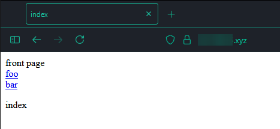
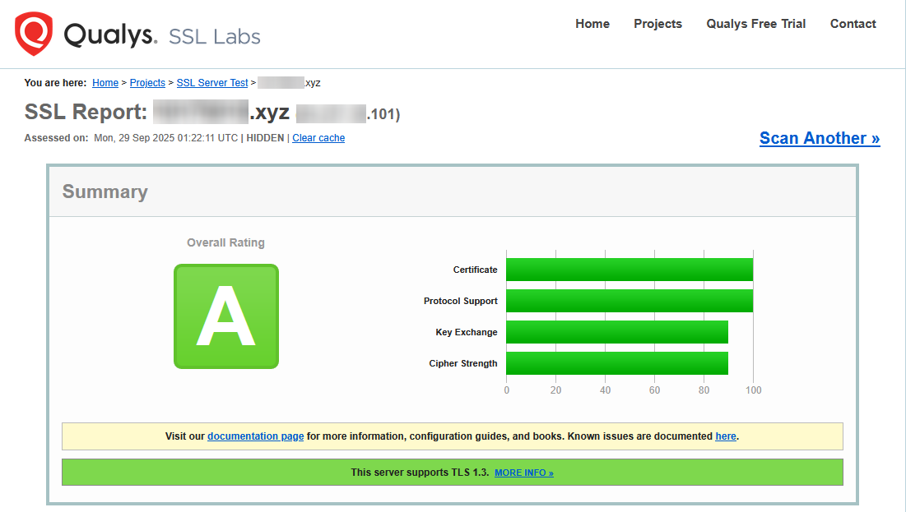
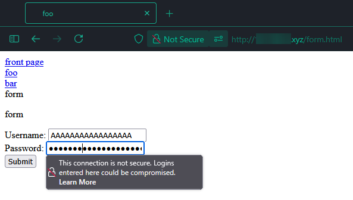
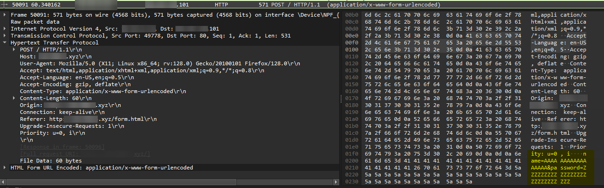

## Artikkelin tiivistys[^1][^2]
- Let's Encrypt myöntää SSL sertifikaatteja käyttäen ACME protokollaa, jonka ansiosta prosessi on mahdollista automatisoida.
- ACME protokollassa asiakkaan tulee varmentaa omistavansa domainin jolle sertifikaatti myönnetään.
- Varmentaminen voi tapahtua usealla eri tavalla, esim. sertifikaatin myöntäjä voi pyytää asiakasta luomaan tietyn tiedoston tiettyyn osoitteeseen domainin alla tai lisäämällä tietyn DNS recordin domainin DNS asetuksiin.
- Tämän jälkeen sertifikaatin myöntäjä testaa useasta eri osoitteesta, että tiedosto tai DNS recordi on olemassa ja jos varmentaminen onnistuu, myöntää sertifikaatin asiakkaalle.
- Minimaalinen konfiguraatio SSL sertifikaatin käyttöönottoon Apache palvelimella:
```apache
LoadModule ssl_module modules/mod_ssl.so

Listen 443
<VirtualHost *:443>
    ServerName www.example.com
    SSLEngine on
    SSLCertificateFile "/path/to/www.example.com.cert"
    SSLCertificateKeyFile "/path/to/www.example.com.key"
</VirtualHost>
```
(SSL/TLS Strong Encryption: How-To, apache.org)


## Tehtävät
(Raportissa oikea domain on korvattu ```<oma-domain>``` tekstillä.)

### a) SSL sertifikaatin hankinta

Aloitetaan asentamalla Certbot tehtävänannossa mainitulla komennolla:
```bash
sudo apt-get install certbot python3-certbot-apache -y
```

Testataan ensin, että palvelin toimii
```bash
$ curl -sI <oma-domain>.xyz | head -n 1
HTTP/1.1 200 OK
```

Avataan TCP-portti 443 palomuurista (HTTPS)
```bash
$ sudo ufw allow 443/tcp
Rule added
Rule added (v6)
```

Ajetaan certbot komento (myös h5[^3] tehtävässä käytetyille alidomaineille foo ja bar):
```bash
$ sudo certbot --apache --domains <oma-domain>.xyz,foo.<oma-domain>.xyz,bar.<oma-domain>.xyz
# ..
Account registered.
Requesting a certificate for <oma-domain>.xyz and 2 more domains

Successfully received certificate.
Certificate is saved at: /etc/letsencrypt/live/<oma-domain>.xyz/fullchain.pem
Key is saved at:         /etc/letsencrypt/live/<oma-domain>.xyz/privkey.pem
This certificate expires on 2025-12-28.
These files will be updated when the certificate renews.
Certbot has set up a scheduled task to automatically renew this certificate in the background.
# ..
Congratulations! You have successfully enabled HTTPS on https://<oma-domain>.xyz, https://foo.<oma-domain>.xyz, and https://bar.<oma-domain>.xyz
# ..
```

Näyttäisi onnistuneen, testataan:
```bash
$ curl -sI https://<oma-domain>.xyz | head -n 1
HTTP/1.1 200 OK
```

Vielä selaimella:



Lukon kuva, eli kaikki ok

### b) A-rating[^4]


### c) HTTP Lomake ja liikenteen sieppaus
Tehdään sivustolle uusi sivu form.html, jossa on lomake käyttäjätunnuksen ja salasanan syöttämiseen form methodina post.

Asennettaan ngrep host koneeseen:
```bash
sudo apt install ngrep -y
```

Käynnistetään ngrep sieppaamaan HTTP liikennettä:
```bash
sudo ngrep port 80
```

Tässä vaiheessa tuli vastaan pieni ongelma, koska Certbot konfiguroi Apache palvelimen niin, että kaikki HTTP liikkenne ohjataan automaattisesti HTTPS:ään.

Ratkaisin ongelman tekemällä /form.html sivulle poikkeuksen Apachen konfiguraatioon.
```diff
 RewriteEngine on
 RewriteCond %{SERVER_NAME} =foo.<oma-domain>.xyz [OR]
 RewriteCond %{SERVER_NAME} =<oma-domain>.xyz [OR]
 RewriteCond %{SERVER_NAME} =bar.<oma-domain>.xyz
+
+RewriteCond %{REQUEST_URI} !^/form\.html
+
 RewriteRule ^ https://%{SERVER_NAME}%{REQUEST_URI} [END,NE,R=permanent]
 </VirtualHost>
```

(Oikolukiessani raporttiani tajusin, että olisin voinut myös yhdistää IP-osoittella domainin sijaan, jolloin Apache ei olisi ohjannut HTTPS:ään, mutta eipä siinä.)

Nyt päästään käsiksi HTTP versioon lomakkeesta, joten avataan se selaimella ja lähetetään lomake.



ngrep ikkunassa näkyy seuraavaa:
```
T ***.***.***:44698 -> ***.***.***.101:80 [AP] #14
  POST / HTTP/1.1..Host: <oma-domain>.xyz..User-Agent: Mozilla/5.0 (X11; Linux x8
  6_64; rv:128.0) Gecko/20100101 Firefox/128.0..Accept: text/html,application
  /xhtml+xml,application/xml;q=0.9,*/*;q=0.8..Accept-Language: en-US,en;q=0.5
  ..Accept-Encoding: gzip, deflate..Content-Type: application/x-www-form-urle
  ncoded..Content-Length: 60..Origin: http://<oma-domain>.xyz..Connection: keep-a
  live..Referer: http://<oma-domain>.xyz/form.html..Upgrade-Insecure-Requests: 1.
  .Priority: u=0, i....name=AAAAAAAAAAAAAAAAA&password=ZZZZZZZZZZZZZZZZZZZZZZ
  ZZZZZZ                                                                     
#
```

Tästä näkyy selvästi, että lomakkeella lähetetyt tiedot (name ja password) kulkevat salaamattomana HTTP yhteyden yli.

Tässä vielä kuva Wiresharkista, virtuaalikoneen ulkopuolelta.


Tämä tarkoittaa sitä, että kuka tahansa, joka pystyy asettamaan itsensä käyttäjän ja palvelimen väliin, voi siepata lomakkeella lähetetyt tiedot.


## Lähteet:
- Tehtävänanto: https://terokarvinen.com/linux-palvelimet/#h6-salataampa
[^1]: Let's Encrypt 2025. How It Works - Let's Encrypt. Luettavissa: https://letsencrypt.org/how-it-works/. Luettu: 29.09.2025.
[^2]: The Apache Software Foundation. SSL/TLS Strong Encryption: How-To - Apache HTTP Server Version 2.4. Luettavissa: https://httpd.apache.org/docs/2.4/ssl/ssl_howto.html#configexample. Luettu: 29.09.2025.
[^3]: 0x00A 2025. linux_palvelimet/h5.md at master · 0x00A/linux_palvelimet. Luettavissa: [h5 raportti](h5.md). Luettu: 29.09.2025.
[^4]: Qualys, Inc. 2025. SSL Server Test (Powered by Qualys SSL Labs). Luettavissa: https://www.ssllabs.com/ssltest/. Luettu: 29.09.2025.