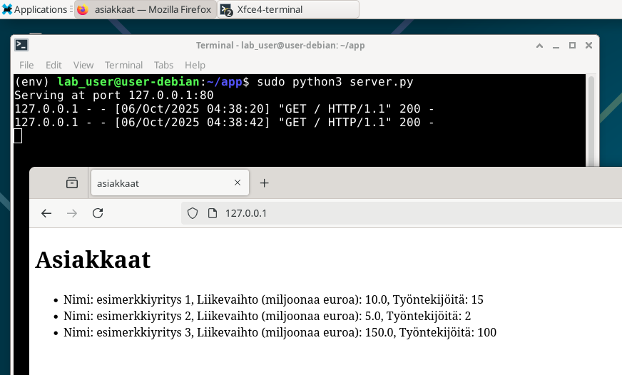
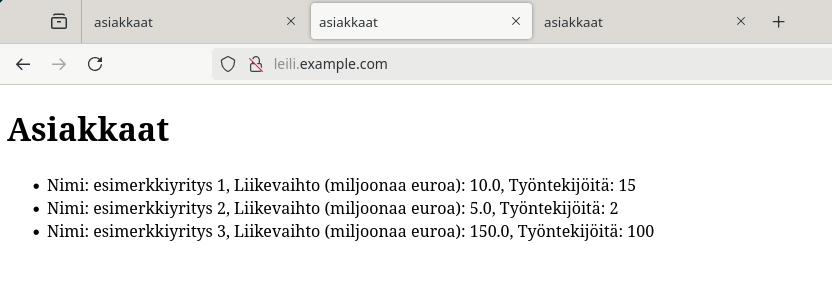
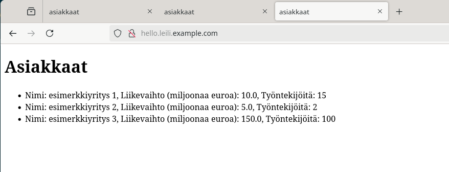

## Tehtävät
### a) Hello World kolmella kielellä
Valitsin kieliksi Pythonin, Bashin ja C sillä niihin tarvittavat työkalut löytyvät oletuksena Debianista.

Aloitetaan luomalla hakemisto ja siirtymällä sinne:
```bash
mkdir ~/hello_world; cd ~/hello_world
```

Luodaan jokaiselle kielelle oma tiedosto:

`~/hello_world/hello_py.py`
```python
if __name__ == "__main__":
	print("Hello World!")
```

`~/hello_world/hello_bash.sh`
```bash
#!/bin/bash
echo "Hello World!"
```

`~/hello_world/hello_c.c`
```c
#include <stdio.h>
int main() {
    printf("Hello World!\n");
    return 0;
}
```

Käännetään C ohjelma:
```bash
gcc hello_c.c -o hello_c
```

Ajetaan ohjelmat:
```bash
$ python3 hello_py.py; bash hello_bash.sh; ./hello_c
Hello World!
Hello World!
Hello World!
```

### c) Uusi komento
Luodaan yksinkertainen bash skripti nimeltä `greet`,  `/usr/local/bin` hakemistoon, joka tervehtii käyttäjää nimellä.

```/usr/local/bin/greet```
```bash
#!/bin/bash
username=$(whoami)
echo "Hello, $username"
```

Laitetaan skriptille suoritusoikeudet:
```bash
sudo chmod +x /usr/local/bin/greet
```

Testataan komento:
```bash
user@user-debian:~$ greet
Hello, user
```

Luodaan uusi käyttäjä ja testataan komento uudelleen:
```bash
sudo adduser testuser
# ... kirjoitetaan salasana ja muut tiedot
su - testuser
testuser@user-debian:~$ greet
Hello, testuser
```

### d) Vanha laboratorioharjoitus
Tehtävänannossa pyydetään tekemään vanha arvioitava laboratoriaharjoitus uudelleen soveltuvin osin. Valitsin harjoituksen [Final Lab for Linux Server Course 2021 Spring](https://terokarvinen.com/2021/final-lab-for-linux-server-course/)[^1].

#### Oma käyttäjä
```bash
sudo adduser lab_user
sudo usermod -aG sudo lab_user
```

Testataan:
```bash
lab_user@user-debian:~$ whoami
lab_user
lab_user@user-debian:~$ sudo whoami
[sudo] password for lab_user: 
root
```

#### Turvallisesti etänä
Asennettaan SSH palvelin
```bash
sudo apt install openssh-server -y
```

Testataan SSH yhteys:
```bash
user@user-debian:~$ ssh lab_user@127.0.0.1
The authenticity of host '127.0.0.1 (127.0.0.1)' can't be established.
ED25519 key fingerprint is SHA256:wnBZHyy1rl6sjywXr/mItvCkgvtSzTUh123/9vXZoWs.
This key is not known by any other names.
Are you sure you want to continue connecting (yes/no/[fingerprint])? yes
Warning: Permanently added '127.0.0.1' (ED25519) to the list of known hosts.
lab_user@127.0.0.1's password: 
Linux user-debian 6.12.41+deb13-amd64 #1 SMP PREEMPT_DYNAMIC Debian 6.12.41-1 (2025-08-12) x86_64

The programs included with the Debian GNU/Linux system are free software;
the exact distribution terms for each program are described in the
individual files in /usr/share/doc/*/copyright.

Debian GNU/Linux comes with ABSOLUTELY NO WARRANTY, to the extent
permitted by applicable law.
lab_user@user-debian:~$ 
```

Suojataan palomuurilla:
```bash
sudo apt install ufw -y
```

Avataan SSH portti 22 ja otetaan palomuuri käyttöön (vaikka testaus onkin paikallisesti):
```bash
$ sudo ufw allow 22/tcp
Rules updated
Rules updated (v6)

$ sudo ufw enable
Firewall is active and enabled on system startup
```

Testataan vielä SSH yhteys:
```bash
user@user-debian:~$ ssh lab_user@127.0.0.1
lab_user@127.0.0.1's password: 
# ...
lab_user@user-debian:~$ 
```

#### Arvostetut asiantuntijamme
Valitsemassani tehtävässä seuraava osio on luoda 5 eri käyttäjää, mielestäni tämä on jo tehty mm. edellisessä osiossa, jossa luotiin käyttäjä `testuser` ja aiemmin tässä osiossa jossa luotiin käyttäjä `lab_user`. Tämä vaihe tehtävässä olisi vain toistaa sama asia uudelleen 4 kertaa, joten lasken tämän osan tehdyksi.

#### Mikä verkko, mikä meininki?
```/usr/local/bin/netsee```
```bash
#!/bin/bash
iproutes=$(ip route show)
ipaddr=$(hostname -I)

echo "Reititystaulu:"
echo $iproutes
echo "IP-osoite:"
echo $ipaddr
```

Oikeudet:
```bash
sudo chmod +x /usr/local/bin/netsee
```

Testataan:
```bash
$ netsee
Reititystaulu:
default via 10.0.2.2 dev enp0s3 proto dhcp src 10.0.2.15 metric 100 10.0.2.0/24 dev enp0s3 proto kernel scope link src 10.0.2.15 metric 100
IP-osoite:
10.0.2.15 fd17:625c:f037:2:9257:a5bd:33da:37ad
```

#### Referenssilista
Tein tätä varten yksinkertaisen Python palvelimen.
```server.py```
```python
import sqlite3
import os
import http.server
import socketserver

PORT = 80
IP_ADDR = "127.0.0.1"

def init_db():
    # jos tietokantatiedosto on olemassa, oletetaan että se on myös alustettu datalla
    if os.path.exists("database.db"):
        conn = sqlite3.connect("database.db")
        conn.execute("pragma journal_mode=wal")
        return conn

    # jos tietokantatiedostoa ei ole, tehdään se ja alustetaan se esimerkkidatalla
    conn = sqlite3.connect("database.db") 
    conn.execute("pragma journal_mode=wal")
    cursor = conn.cursor()
    cursor.execute('''
        CREATE TABLE IF NOT EXISTS customers (
            id INTEGER PRIMARY KEY AUTOINCREMENT,
            name TEXT NOT NULL,
            revenue REAL NOT NULL,
            employees INTEGER NOT NULL
        );
    ''')

    cursor.execute('''            
        INSERT INTO customers(name, revenue, employees) VALUES
            ("esimerkkiyritys 1", 10, 15),
            ("esimerkkiyritys 2", 5, 2),
            ("esimerkkiyritys 3", 150, 100);
    ''')
    
    conn.commit()
    # palautetaan yhteys tietokantaan, jotta sitä on mahdollista uudelleenkäyttää
    return conn

# https://docs.python.org/3/library/socketserver.html
# https://docs.python.org/3/library/http.server.html#http.server.BaseHTTPRequestHandler
class SimpleServer(socketserver.TCPServer):
    def __init__(self, server_address, RequestHandlerClass):
            super().__init__(server_address, RequestHandlerClass)
            self.db_conn = init_db()

class RequestHandler(http.server.SimpleHTTPRequestHandler):    
    def do_GET(self):
        # jos haetaan etusivua
        if self.path == '/' or self.path == "/index" or self.path == "/index.html":
            # palautetaan 200 ok
            self.send_response(200)
            self.send_header('Content-type', 'text/html')
            self.end_headers()
            # haetaan kaikki asiakkaat tietokannasta
            all_customers = self.server.db_conn.execute("SELECT * FROM customers").fetchall()
            # rakennetaan yksinkertainen sivu näyttämään ne
            response = '<!DOCTYPE html><html lang="fi"><meta charset="UTF-8"><title>asiakkaat</title>'
            response += "<h1>Asiakkaat</h1><ul>"
            for customer in all_customers:
                response += f"<li>Nimi: {customer[1]}, Liikevaihto (miljoonaa euroa): {customer[2]}, Työntekijöitä: {customer[3]}</li>"
            response += "</ul>"
            self.wfile.write(response.encode())


if __name__ == '__main__':
    with SimpleServer((IP_ADDR, PORT), RequestHandler) as httpd:
        print(f"Serving at port {IP_ADDR}:{PORT}")
        httpd.serve_forever()
```

Testataan:

Avataan palomuurista HTTP portti 80 (vaikka testaus onkin paikallisesti):
```bash
sudo ufw allow 80/tcp
```

Ajetaan palvelin:
```bash
sudo python3 server.py
```

Testataan selaimella:



#### Kuormaa
Tehtävänannossa[^1] mainitaan `ab` työkalu, joka ei ole itselle ennestään tuttu.
```bash
$ sudo apt install ab
[sudo] password for lab_user: 
Error: Unable to locate package ab
```

Tätä ei löydy tällä nimellä, löysin verkosta ohjeen[^2] joka viittaisi siihen että työkalu on osa `apache2-utils` pakettia.

```bash
$ sudo apt install apache2-utils
apache2-utils is already the newest version (2.4.65-2).
apache2-utils set to manually installed.
Summary:
  Upgrading: 0, Installing: 0, Removing: 0, Not Upgrading: 0
```

Se olikin jo asennettu.

Tehtävässä pyydetään tekemään 100 pyyntöä sekunnissa.
Man sivuilta selviää, että `-n` määrittää pyyntöjen kokonaismäärän ja `-c` samanaikaisten yhteyksien määrän.

Testataan 5000 pyyntöä 100 samanaikaisella yhteydellä:
```bash
$ ab -n 5000 -c 100 http://127.0.0.1:80/
This is ApacheBench, Version 2.3 <$Revision: 1923142 $>
Copyright 1996 Adam Twiss, Zeus Technology Ltd, http://www.zeustech.net/
Licensed to The Apache Software Foundation, http://www.apache.org/

Benchmarking 127.0.0.1 (be patient)
Completed 500 requests
Completed 1000 requests
Completed 1500 requests
Completed 2000 requests
Completed 2500 requests
Completed 3000 requests
Completed 3500 requests
Completed 4000 requests
Completed 4500 requests
Completed 5000 requests
Finished 5000 requests


Server Software:        SimpleHTTP/0.6
Server Hostname:        127.0.0.1
Server Port:            80

Document Path:          /
Document Length:        377 bytes

Concurrency Level:      100
Time taken for tests:   1.572 seconds
Complete requests:      5000
Failed requests:        0
Total transferred:      2480000 bytes
HTML transferred:       1885000 bytes
Requests per second:    3181.48 [#/sec] (mean)
Time per request:       31.432 [ms] (mean)
Time per request:       0.314 [ms] (mean, across all concurrent requests)
Transfer rate:          1541.03 [Kbytes/sec] received

Connection Times (ms)
              min  mean[+/-sd] median   max
Connect:        0    0  14.2      0    1007
Processing:     0    2   0.7      2       6
Waiting:        0    2   0.7      2       6
Total:          0    2  14.3      2    1009

Percentage of the requests served within a certain time (ms)
  50%      2
  66%      2
  75%      2
  80%      2
  90%      3
  95%      3
  98%      4
  99%      5
 100%   1009 (longest request)
```

Palvelin kesti hyvin, tämä ei tullut yllätyksenä sillä palvelin on hyvin yksinkertainen, datan määrä on pieni ja testi ajettiin paikallisesti.

#### Kaksi nimeä, yksi IP
```bash
echo -e "127.0.0.1 leili.example.com\n127.0.0.1 hello.leili.example.com" | sudo tee -a /etc/hosts
```


## Lähteet:
- Tehtävänanto: https://terokarvinen.com/linux-palvelimet/#h7-maalisuora
[^1]: Tero Karvinen 2021. Final Lab for Linux Server Course 2021 Spring. Luettavissa: https://terokarvinen.com/2021/final-lab-for-linux-server-course/. Luettu: 06.10.2025.
[^2]: Debian Manpages 2025. ab(1) — apache2-utils — Debian testing — Debian Manpages. Luettavissa: https://manpages.debian.org/testing/apache2-utils/ab.1.en.html. Luettu: 06.10.2025.