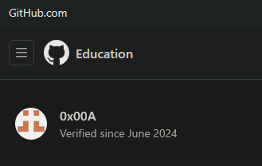

#### a) Vapaaehtoiset tehtävät

- h1: 1/1
    - [Suosikkiohjelmani linuxilla](h1.md#suosikkiohjelmani-linuxilla)
- h2: 1/2
    - [Micro plugin](h2.md#h-micro-plugin-asennus2)
- h3: 2/2
    - Github Education paketti oli jo valmiina, mutta en tajunnut sitä tuossa mainita.
    
    - [Kaksi eri sivua](h3.md#o-kaksi-eri-sivustoa)
- h4: 1/1
    - [Name Based Virtual Host](h4.md#c--d-web-palvelin3)
- h5: 1/1
    - [Aakkossalaatti](h5.md#d-spf-ja-dmarc)
- h6: 1/1
    - [HTTP-Lomake ja liikenteen sieppaus](h6.md#c-http-lomake-ja-liikenteen-sieppaus)
- h7: 0/0
- h8: 2/2
    - [Vapaaehtoiset tehtävät](h8.md#a-vapaaehtoiset-tehtävät)
    - [Ristiinarvioinnin jälkeen olennaisesti parannetut tehtävät](h8.md#b-ristiinarvioinnin-jälkeen-olennaisesti-parannetut-tehtävät)

#### b) Ristiinarvioinnin jälkeen olennaisesti parannetut tehtävät
Sain ristiinarvioinnissa kahdenlaista palautetta, jossa oli parannusideoita.

Yleisin palaute jota tuli oli, että kuvia saisi olla enemmän. Ymmärrän tämän sillä raportin kirjoittamisen ohjeissa oli pyydetty ottamaan kuvia. Mielestäni kuitenkin koska työskentely tapahtuu suurimman osan ajasta komentorivillä, on parempi liittää komentorivin tulostus tekstinä kuin kuvana. Tämä mahdollistaa esimerkiksi käytettyjen komentojen helpon kopioinnin, sekä tekstin hakemisen (Ctrl+F).

Kuitenkin kaikisissa kohdissa, joissa poistuttiin komentoriviltä, esimerkiksi testattiin selaimessa, niin liitin kyllä kuvan.

Toinen palaute joka mainittiin kerran, oli, että lähteet olivat kyllä merkattu, mutta tapa jolla ne oli merkitty ei ollut hyvä, joten tehtävän h7 lähdemerkinnän ja ristiinarvioinnin jälkeen paransin niitä hiukan.

## Lähteet
- Tehtävänanto: https://terokarvinen.com/linux-palvelimet/#h8-bonus
